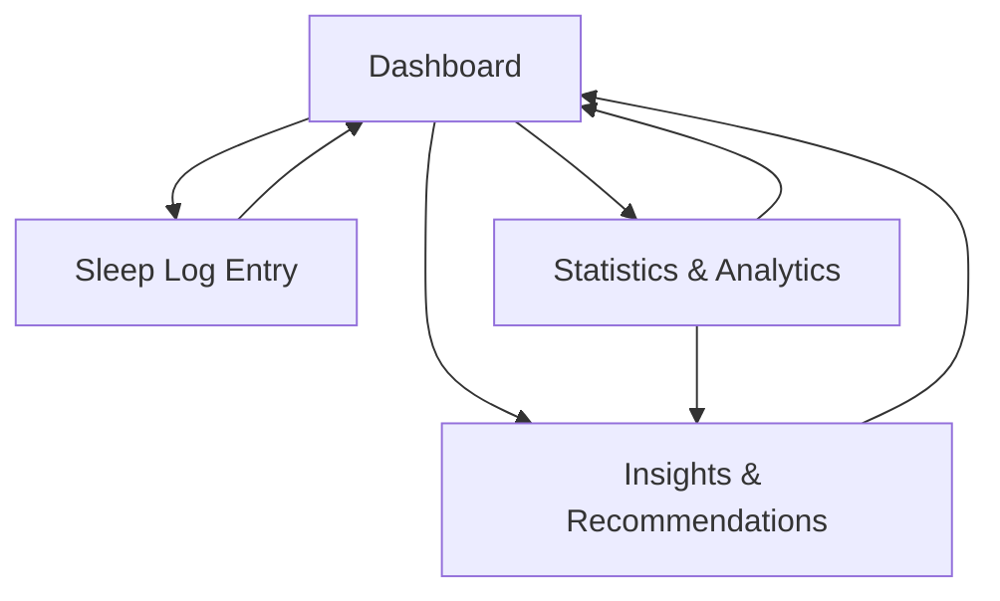

# Sleep Tracker Website - Product Requirements Document v1.0

## 1. Product Overview

A web-based sleep tracking application that helps users monitor their sleep patterns, log daily sleep data, and receive personalized insights to improve their sleep habits.

The product solves the problem of poor sleep awareness by providing users with an easy-to-use platform to track sleep duration, quality, and patterns, ultimately helping them develop healthier sleep routines.

## 2. Core Features

### 2.1 User Roles

This application uses a single-user approach with default user access to all features, eliminating the need for complex authentication in the MVP version.

### 2.2 Feature Module

Our sleep tracker consists of the following main pages:

1. **Dashboard**: sleep overview, recent entries, quick stats display
2. **Sleep Log Entry**: daily sleep input form, sleep quality rating, notes section
3. **Statistics & Analytics**: sleep duration trends, quality patterns, weekly/monthly views
4. **Insights & Recommendations**: personalized sleep tips, habit formation guidance, sleep score analysis, bedtime reminders

### 2.3 Page Details

| Page Name                  | Module Name           | Feature description                                                                                  |
| -------------------------- | --------------------- | ---------------------------------------------------------------------------------------------------- |
| Dashboard                  | Sleep Overview        | Display current sleep streak, average sleep duration, and sleep quality score for quick reference    |
| Dashboard                  | Recent Entries        | Show last 7 days of sleep entries with basic details (bedtime, wake time, duration)                  |
| Dashboard                  | Quick Stats           | Present key metrics like weekly average, best/worst sleep days, and improvement trends               |
| Sleep Log Entry            | Daily Sleep Form      | Input bedtime, wake time, sleep quality rating (1-10), and optional notes about sleep experience     |
| Sleep Log Entry            | Sleep Quality Rating  | Provide intuitive rating system with visual indicators for sleep quality assessment                  |
| Sleep Log Entry            | Notes Section         | Allow users to add contextual information about factors affecting sleep (stress, caffeine, exercise) |
| Statistics & Analytics     | Duration Trends       | Visualize sleep duration patterns over time using charts and graphs                                  |
| Statistics & Analytics     | Quality Patterns      | Track sleep quality trends and identify patterns in sleep satisfaction                               |
| Statistics & Analytics     | Time Period Views     | Enable switching between daily, weekly, and monthly data visualization                               |
| Insights & Recommendations | Personalized Tips     | Generate customized recommendations based on user's sleep patterns and identified issues             |
| Insights & Recommendations | Habit Formation Guide | Provide actionable advice for developing better sleep routines and maintaining consistency           |
| Insights & Recommendations | Bedtime Reminders     | Send intelligent notifications based on optimal bedtime calculated from sleep goals and wake time    |

## 3. Core Process

The main user flow involves daily sleep logging and periodic review of sleep patterns:

1. User visits Dashboard to see current sleep status and recent entries
2. User navigates to Sleep Log Entry to input daily sleep data (bedtime, wake time, quality)
3. User adds optional notes about sleep experience and factors
4. User reviews Statistics & Analytics to understand sleep patterns and trends
5. User checks Insights & Recommendations for personalized advice and sleep improvement tips
6. User returns to Dashboard for ongoing monitoring and motivation

## 4. User Interface Design

### 4.1 Design Style

* **Primary Colors**: Deep blue (#2C3E50) for headers and navigation, soft blue (#3498DB) for accents

* **Secondary Colors**: Light gray (#ECF0F1) for backgrounds, white (#FFFFFF) for content areas

* **Button Style**: Rounded corners with subtle shadows, gradient effects for primary actions

* **Font**: Clean sans-serif font (Inter or similar), 16px base size, 18px for headings

* **Layout Style**: Card-based design with clean spacing, top navigation bar with breadcrumbs

* **Icons**: Minimalist line icons for sleep-related actions (moon, sun, clock, chart symbols)

### 4.2 Page Design Overview

| Page Name                  | Module Name           | UI Elements                                                                                              |
| -------------------------- | --------------------- | -------------------------------------------------------------------------------------------------------- |
| Dashboard                  | Sleep Overview        | Large circular progress indicator showing sleep score, color-coded status cards with key metrics         |
| Dashboard                  | Recent Entries        | Timeline-style list with date, sleep duration bars, and quality star ratings                             |
| Dashboard                  | Quick Stats           | Compact metric cards with icons, trend arrows, and color-coded performance indicators                    |
| Sleep Log Entry            | Daily Sleep Form      | Time picker inputs, slider for quality rating, expandable text area for notes                            |
| Sleep Log Entry            | Sleep Quality Rating  | Interactive star rating or emoji-based scale with hover effects and visual feedback                      |
| Sleep Log Entry            | Notes Section         | Auto-expanding textarea with character count, suggested tags for common factors                          |
| Statistics & Analytics     | Duration Trends       | Line charts with smooth curves, interactive tooltips, date range selector                                |
| Statistics & Analytics     | Quality Patterns      | Bar charts and heatmap calendar view, color-coded quality levels                                         |
| Statistics & Analytics     | Time Period Views     | Tab-based navigation for different time periods, animated transitions between views                      |
| Insights & Recommendations | Personalized Tips     | Card-based layout with actionable tips, progress tracking for implemented suggestions                    |
| Insights & Recommendations | Habit Formation Guide | Step-by-step checklist format with progress indicators and motivational elements                         |
| Insights & Recommendations | Bedtime Reminders     | Toggle switches for reminder preferences, time selector for custom reminder timing, notification preview |

### 4.3 Responsiveness

The application is designed mobile-first with responsive breakpoints, ensuring optimal experience on smartphones, tablets, and desktop devices. Touch-friendly interactions are prioritized for mobile users, with appropriate button sizes and gesture support.
