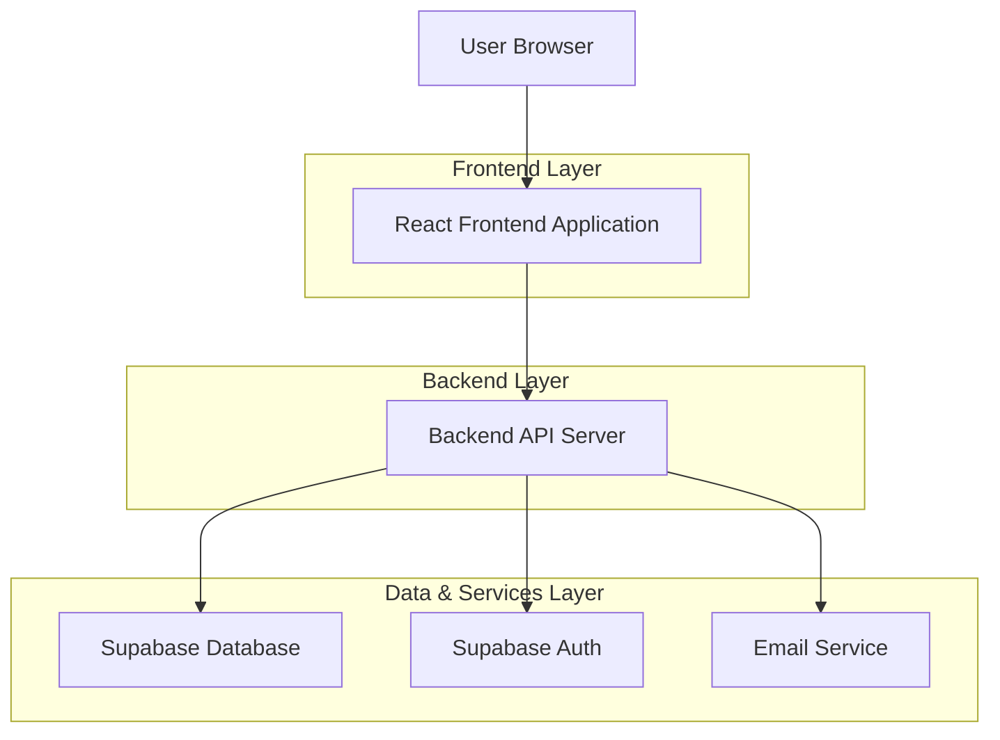
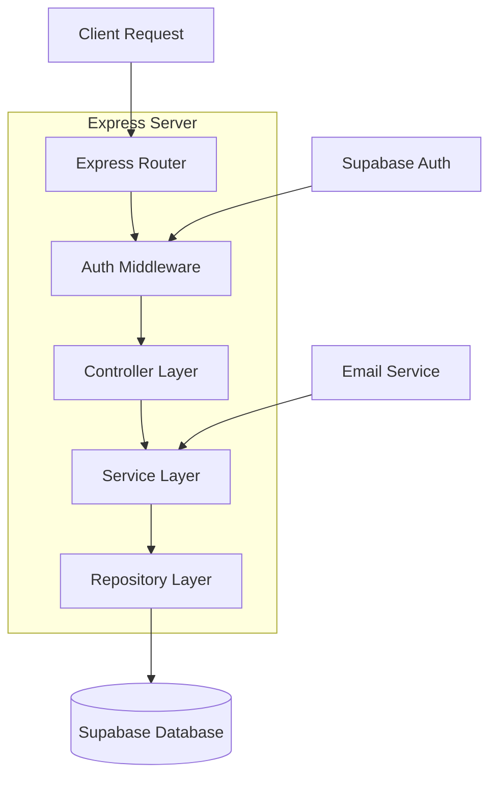
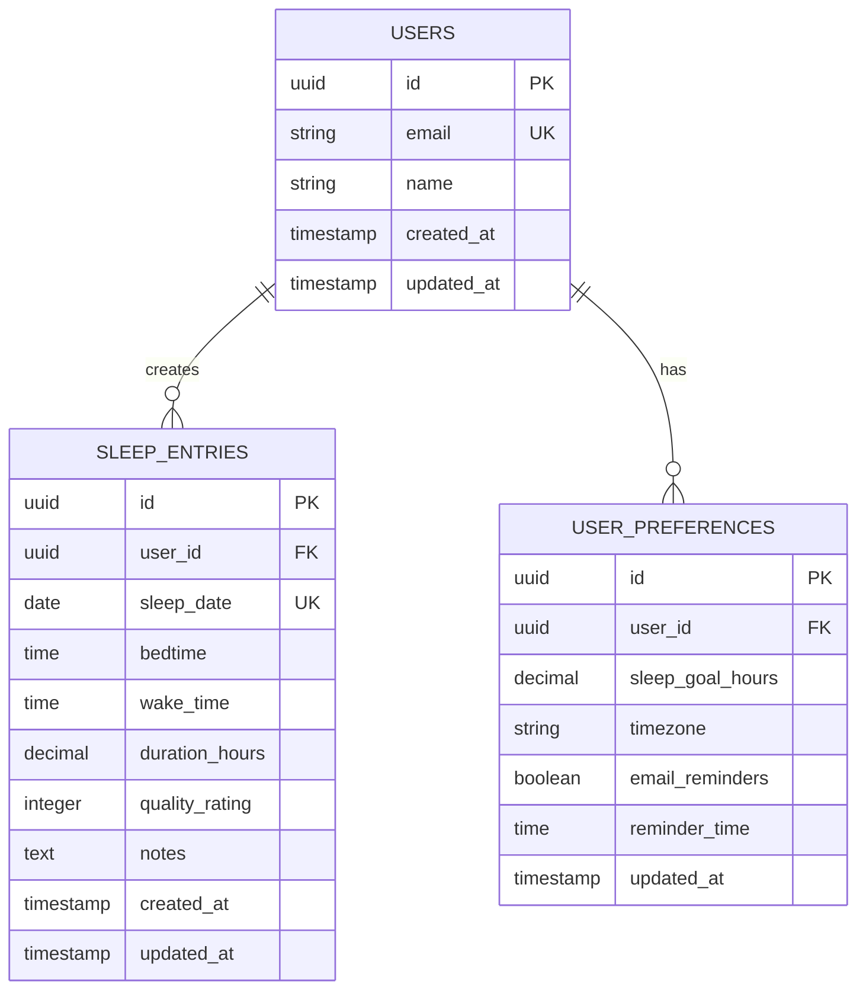

# Sleep Tracker - Technical Architecture Document

## 1. Architecture Design



## 2. Technology Description

* Frontend: React\@18 + TypeScript + Tailwind CSS + Vite

* Backend: Node.js + Express\@4 + TypeScript

* Database: Supabase (PostgreSQL)

* Authentication: Supabase Auth

* Email Service: Supabase (SMTP)

* Deployment: Vercel (Frontend) + Vercel Serverless Functions (Backend)

## 3. Route Definitions

| Route            | Purpose                            | Auth Required |
| ---------------- | ---------------------------------- | ------------- |
| /                | Landing page with demo access      | No            |
| /signup          | User registration page             | No            |
| /signin          | User login page                    | No            |
| /forgot-password | Password reset request             | No            |
| /reset-password  | Password reset form                | No            |
| /dashboard       | Main dashboard with sleep overview | Yes           |
| /sleep-log       | Sleep entry form                   | Yes           |
| /analytics       | Sleep statistics and trends        | Yes           |
| /insights        | Personalized recommendations       | Yes           |
| /profile         | User profile and account settings  | Yes           |
| /demo            | Demo dashboard with sample data    | No            |

## 4. API Definitions

### 4.1 Authentication APIs

**User Registration**

```
POST /api/auth/signup
```

Request:

| Param Name | Param Type | isRequired | Description                      |
| ---------- | ---------- | ---------- | -------------------------------- |
| email      | string     | true       | User email address               |
| password   | string     | true       | User password (min 8 characters) |
| name       | string     | true       | User full name                   |
| timezone   | string     | false      | User timezone (default: UTC)     |

Response:

| Param Name | Param Type | Description                       |
| ---------- | ---------- | --------------------------------- |
| success    | boolean    | Registration status               |
| message    | string     | Success or error message          |
| user       | object     | User profile data (if successful) |

**User Login**

```
POST /api/auth/signin
```

Request:

| Param Name | Param Type | isRequired | Description        |
| ---------- | ---------- | ---------- | ------------------ |
| email      | string     | true       | User email address |
| password   | string     | true       | User password      |

Response:

| Param Name | Param Type | Description       |
| ---------- | ---------- | ----------------- |
| success    | boolean    | Login status      |
| token      | string     | JWT access token  |
| user       | object     | User profile data |

### 4.2 User Profile APIs

**Get User Profile**

```
GET /api/user/profile
```

Response:

| Param Name  | Param Type | Description            |
| ----------- | ---------- | ---------------------- |
| id          | string     | User unique identifier |
| email       | string     | User email address     |
| name        | string     | User full name         |
| sleep\_goal | number     | Target sleep hours     |
| timezone    | string     | User timezone          |
| created\_at | string     | Account creation date  |

**Update User Profile**

```
PUT /api/user/profile
```

Request:

| Param Name  | Param Type | isRequired | Description               |
| ----------- | ---------- | ---------- | ------------------------- |
| name        | string     | false      | Updated user name         |
| sleep\_goal | number     | false      | Target sleep hours (6-12) |
| timezone    | string     | false      | User timezone             |

### 4.3 Sleep Data APIs

**Create Sleep Entry**

```
POST /api/sleep/entries
```

Request:

| Param Name | Param Type | isRequired | Description                 |
| ---------- | ---------- | ---------- | --------------------------- |
| date       | string     | true       | Sleep date (YYYY-MM-DD)     |
| bedtime    | string     | true       | Bedtime (HH:MM format)      |
| wake\_time | string     | true       | Wake time (HH:MM format)    |
| quality    | number     | true       | Sleep quality rating (1-10) |
| notes      | string     | false      | Optional sleep notes        |

**Get Sleep Entries**

```
GET /api/sleep/entries?start_date=YYYY-MM-DD&end_date=YYYY-MM-DD
```

Response:

| Param Name   | Param Type | Description                  |
| ------------ | ---------- | ---------------------------- |
| entries      | array      | Array of sleep entry objects |
| total\_count | number     | Total number of entries      |

**Get Sleep Analytics**

```
GET /api/sleep/analytics?period=week|month|year
```

Response:

| Param Name    | Param Type | Description                     |
| ------------- | ---------- | ------------------------------- |
| avg\_duration | number     | Average sleep duration in hours |
| avg\_quality  | number     | Average sleep quality score     |
| sleep\_trend  | array      | Daily sleep data for charts     |
| insights      | array      | Personalized recommendations    |

## 5. Server Architecture Diagram



## 6. Data Model

### 6.1 Data Model Definition



### 6.2 Data Definition Language

**Users Table (handled by Supabase Auth)**

```sql
-- Supabase Auth handles user authentication
-- Additional user data stored in user_profiles table

CREATE TABLE user_profiles (
  id UUID PRIMARY KEY REFERENCES auth.users(id) ON DELETE CASCADE,
  name VARCHAR(100) NOT NULL,
  sleep_goal_hours DECIMAL(3,1) DEFAULT 8.0 CHECK (sleep_goal_hours >= 6 AND sleep_goal_hours <= 12),
  timezone VARCHAR(50) DEFAULT 'UTC',
  email_reminders BOOLEAN DEFAULT true,
  reminder_time TIME DEFAULT '22:00:00',
  created_at TIMESTAMP WITH TIME ZONE DEFAULT NOW(),
  updated_at TIMESTAMP WITH TIME ZONE DEFAULT NOW()
);
```

**Sleep Entries Table**

```sql
CREATE TABLE sleep_entries (
  id UUID PRIMARY KEY DEFAULT gen_random_uuid(),
  user_id UUID NOT NULL REFERENCES auth.users(id) ON DELETE CASCADE,
  sleep_date DATE NOT NULL,
  bedtime TIME NOT NULL,
  wake_time TIME NOT NULL,
  duration_hours DECIMAL(4,2) GENERATED ALWAYS AS (
    CASE 
      WHEN wake_time >= bedtime THEN 
        EXTRACT(EPOCH FROM (wake_time - bedtime)) / 3600
      ELSE 
        EXTRACT(EPOCH FROM (wake_time + INTERVAL '24 hours' - bedtime)) / 3600
    END
  ) STORED,
  quality_rating INTEGER NOT NULL CHECK (quality_rating >= 1 AND quality_rating <= 10),
  notes TEXT,
  created_at TIMESTAMP WITH TIME ZONE DEFAULT NOW(),
  updated_at TIMESTAMP WITH TIME ZONE DEFAULT NOW(),
  UNIQUE(user_id, sleep_date)
);
```

**Indexes and Permissions**

```sql
-- Create indexes for better query performance
CREATE INDEX idx_sleep_entries_user_date ON sleep_entries(user_id, sleep_date DESC);
CREATE INDEX idx_sleep_entries_created_at ON sleep_entries(created_at DESC);
CREATE INDEX idx_user_profiles_user_id ON user_profiles(id);

-- Row Level Security (RLS) policies
ALTER TABLE user_profiles ENABLE ROW LEVEL SECURITY;
ALTER TABLE sleep_entries ENABLE ROW LEVEL SECURITY;

-- Users can only access their own data
CREATE POLICY "Users can view own profile" ON user_profiles
  FOR SELECT USING (auth.uid() = id);

CREATE POLICY "Users can update own profile" ON user_profiles
  FOR UPDATE USING (auth.uid() = id);

CREATE POLICY "Users can insert own profile" ON user_profiles
  FOR INSERT WITH CHECK (auth.uid() = id);

CREATE POLICY "Users can view own sleep entries" ON sleep_entries
  FOR SELECT USING (auth.uid() = user_id);

CREATE POLICY "Users can insert own sleep entries" ON sleep_entries
  FOR INSERT WITH CHECK (auth.uid() = user_id);

CREATE POLICY "Users can update own sleep entries" ON sleep_entries
  FOR UPDATE USING (auth.uid() = user_id);

CREATE POLICY "Users can delete own sleep entries" ON sleep_entries
  FOR DELETE USING (auth.uid() = user_id);

-- Grant permissions
GRANT SELECT ON user_profiles TO anon;
GRANT ALL PRIVILEGES ON user_profiles TO authenticated;
GRANT SELECT ON sleep_entries TO anon;
GRANT ALL PRIVILEGES ON sleep_entries TO authenticated;
```

**Initial Demo Data**

```sql
-- Insert demo user profile (for demo mode)
INSERT INTO user_profiles (id, name, sleep_goal_hours, timezone)
VALUES (
  '00000000-0000-0000-0000-000000000000',
  'Demo User',
  8.0,
  'UTC'
);

-- Insert sample sleep entries for demo
INSERT INTO sleep_entries (user_id, sleep_date, bedtime, wake_time, quality_rating, notes)
VALUES 
  ('00000000-0000-0000-0000-000000000000', CURRENT_DATE - INTERVAL '1 day', '23:00:00', '07:00:00', 8, 'Good night sleep'),
  ('00000000-0000-0000-0000-000000000000', CURRENT_DATE - INTERVAL '2 days', '23:30:00', '06:45:00', 6, 'Woke up a bit tired'),
  ('00000000-0000-0000-0000-000000000000', CURRENT_DATE - INTERVAL '3 days', '22:45:00', '07:15:00', 9, 'Excellent sleep quality'),
  ('00000000-0000-0000-0000-000000000000', CURRENT_DATE - INTERVAL '4 days', '00:15:00', '07:30:00', 5, 'Went to bed too late'),
  ('00000000-0000-0000-0000-000000000000', CURRENT_DATE - INTERVAL '5 days', '22:30:00', '06:30:00', 7, 'Decent sleep'),
  ('00000000-0000-0000-0000-000000000000', CURRENT_DATE - INTERVAL '6 days', '23:15:00', '07:00:00', 8, 'Felt refreshed'),
  ('00000000-0000-0000-0000-000000000000', CURRENT_DATE - INTERVAL '7 days', '22:00:00', '06:45:00', 9, 'Early bedtime worked well');
```

